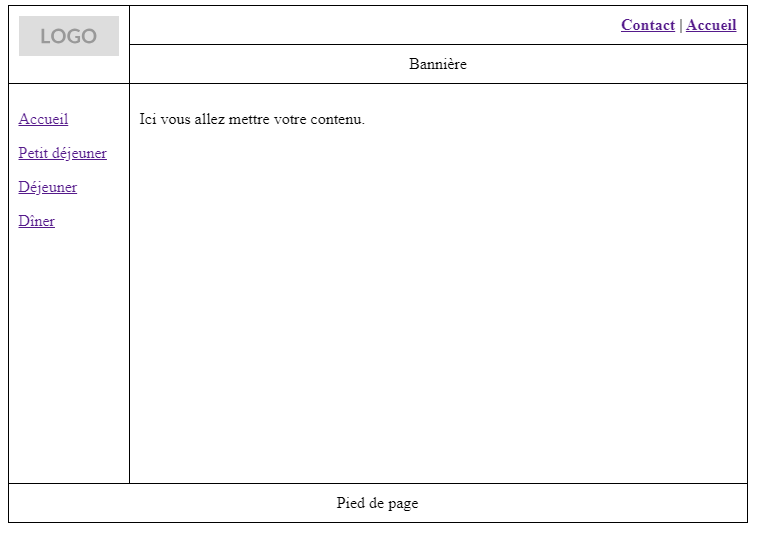
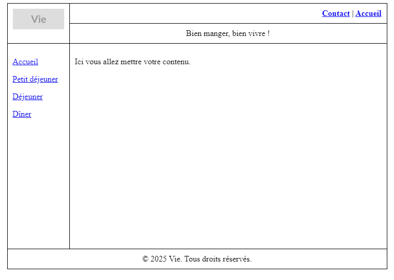
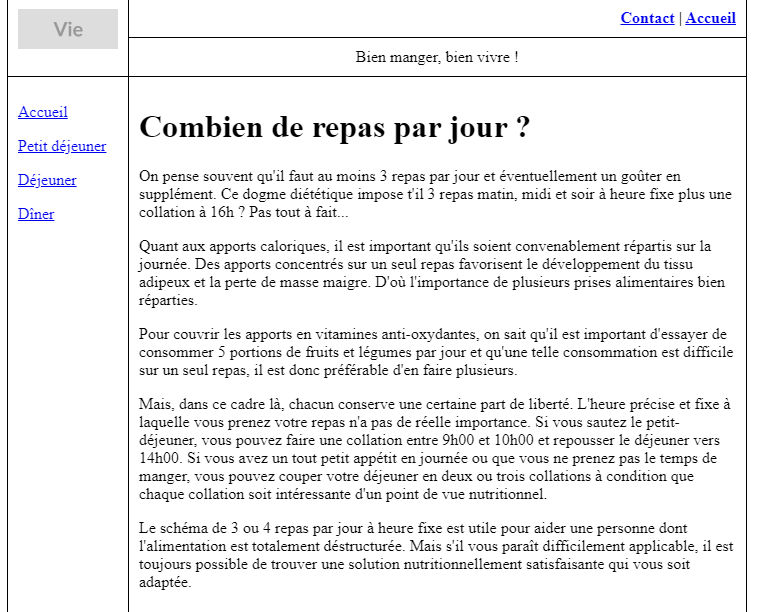
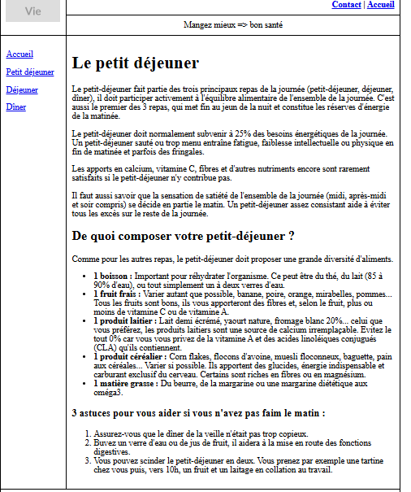
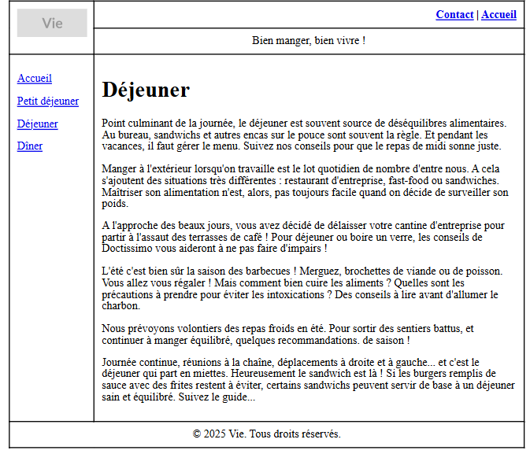
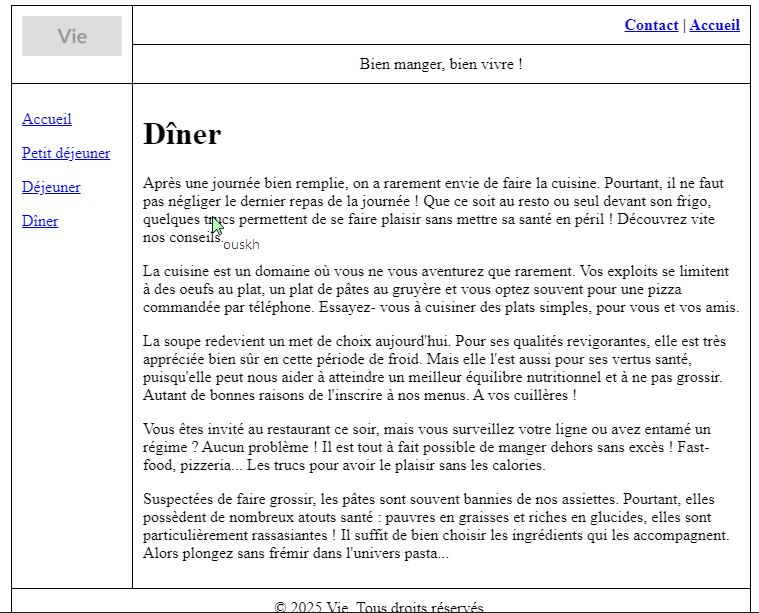

# **Travaux Pratiques : Création d'un Site Web avec HTML et Tableaux**

## **1. Introduction**
Ce projet a pour but de développer un site web structuré en utilisant des tableaux pour la mise en page. Il comprend quatre pages principales, toutes basées sur un modèle commun afin d’assurer une cohérence visuelle et une gestion simplifiée.

### **Structure du Site**
L’organisation du site est représentée ci-dessous :  

## **2. Tâches Accomplies**

### **2.1. Création du Modèle de Base (`gabari.html`)**
- Mise en place d’un fichier **`gabari.html`**, servant de modèle pour l’ensemble des pages du site.
- Ce modèle intègre les éléments communs suivants :
  - Logo
  - Menu de navigation (Accueil, Petit déjeuner, Déjeuner, Dîner)
  - Bannière
  - Pied de page

  

### **2.2. Développement des Pages du Site**
Chaque page repose sur le modèle de base :

- **Page d’accueil (`index.html`)**  
  

- **Page du Petit Déjeuner (`petit-dejeuner.html`)**  
  

- **Page du Déjeuner (`dejeuner.html`)**  
  

- **Page du Dîner (`diner.html`)**  
  

## **3. Conclusion**
Ce projet a permis d’acquérir une meilleure compréhension des concepts fondamentaux du développement web en utilisant les tableaux pour structurer la mise en page. L’adoption d’un modèle commun (`gabari.html`) facilite la gestion des éléments récurrents et garantit une présentation homogène sur l’ensemble du site.
